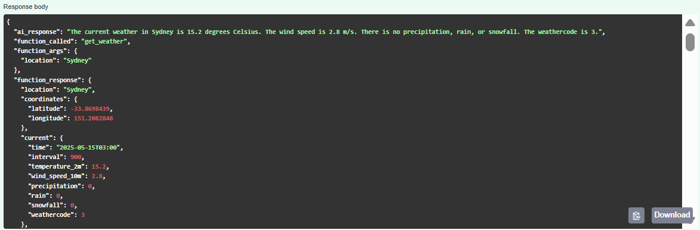

# Function Calling API with Gemini and FastAPI

A FastAPI application that combines Gemini's AI capabilities with various external APIs to provide real-time data and information.

## Features

- Weather forecasts
- Stock price data
- Cryptocurrency prices
- Flight information
- Currency exchange rates and conversion
- Timezone-based current time
- Natural language processing with Gemini AI

## Prerequisites

- Python 3.11 or higher
- Required API keys:
  - Gemini API key
  - Financial Modeling Prep API key
  - AviationStack API key
  - ExchangeRate API key

## Installation

1. Clone the repository
2. Install dependencies:

```sh
pip install -r requirements.txt
```

3. Create a `.env` file with your API keys:

- Note: the FUNCTION_CALLING_API_KEY is your authentication key that you make up yourself

```
GEMINI_API_KEY=your_gemini_api_key
FMG_API=your_financial_modeling_prep_api_key
FLIGHT_API=your_aviationstack_api_key
EXCHANGE_RATE_API=your_exchange_rate_api_key
FUNCTION_CALLING_API_KEY=your_function_calling_api_key
```

## Running the Application

Start the FastAPI server:

```sh
uvicorn gemini_function_calling:app --reload
```

The server will start at `http://localhost:8000`

## Testing with Swagger UI

1. Open your browser and navigate to `http://localhost:8000/docs`
2. Click the "Authorize" button in the top-right corner
3. Enter your Function_Calling_API_KEY as a Bearer token (without "Bearer" prefix)
4. Test the API endpoint:
   - Click on the POST `/` endpoint
   - Click "Try it out"
   - Enter a test query in the request body, for example:

```json
{
  "user_input": "What's the weather like in Tokyo?"
}
```

- Click "Execute"
- View the response in the "Response body" section

## Example Queries

- "What's the weather like in New York?"
- "Get the current stock price for AAPL"
- "Show me the historical data for TSLA over the last 5 days"
- "What's the current price of Bitcoin?"
- "Get the status of flight AA100"
- "Convert 100 USD to EUR"
- "What's the current time in Tokyo?"

## Response Format

The API returns responses in the following format:

```json
{
  "ai_response": "Natural language response from Gemini",
  "function_called": "Name of the function that was called",
  "function_args": {
    "argument_name": "argument_value"
  },
  "function_response": {
    "data": "Function response data"
  }
}
```

## Examples

- "What is the weather in Sydney?"
  
- "Get the current stock price for AAPL"
  

## API Security

The API is protected with an API key. Include your API key in the `Authorization` header when making requests.
